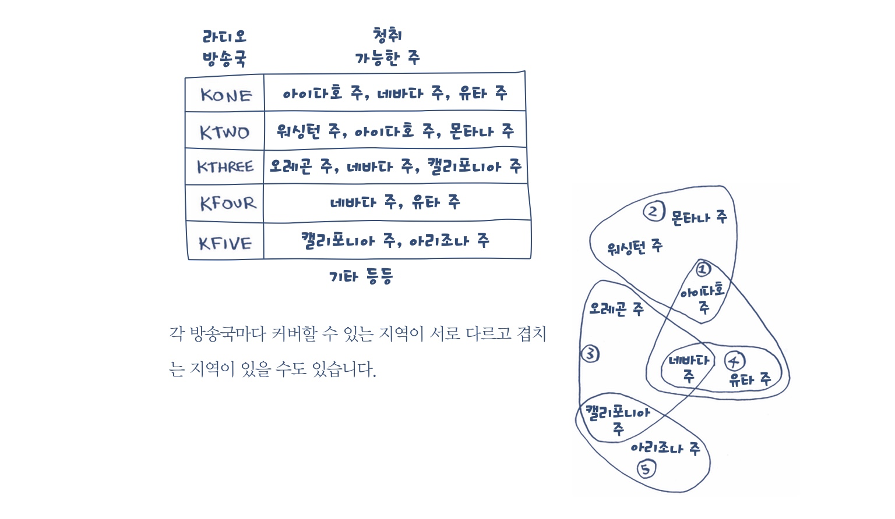

# 8. 탐욕 알고리즘 

# 1. 탐욕 알고리즘이란?

> 당장 눈 앞에 보이는 최적의 상황만 쫓는 알고리즘. 예를 들어 도둑이 있다면, 1. 가방에 들어가는 가장 비싼 물건을 고른다. 2. 그 다음으로 비싼 물건을 고른다. 반복한다. 이렇게 진행하는 것이 탐욕 알고리즘이다.

- 완벽한 답이 아닐 수도 있다.
- 하지만 정답에 가깝다. 그리고 판단이 빠르다.

---

# 2. 집합 커버링 문제

## 2-1. 문제

> 전국 모든 주에서 방송을 해야하고, 돈이 들기 때문에 가장 적은 수의 방송국을 돌아야 한다.

## 2-2. 해결 방안

1. 멱집합 중 찾기 
    - 우선 라디오 방송국의 멱집합을 구해서 그 중 모든 주를 커버하면서 가장 원소의 중가 적은 부분 집합을 구한다. ⇒ 2^n ⇒ O(2^n)
    - 이는 방송국 수가 적으면 상관 없지만 많아지면 너무 오래 걸린다.
2. 근사 알고리즘 (탐욕 알고리즘) 
-  아직 방송하지 않은 지역 가장 많은 지역에서 방송할 수 있는 방송국을 고른다. 2. 모든 주에서 방송이 될 때까지 1를 반복한다.
- [기본 소스](https://github.com/JUNGEEYOU/Greedy_Algorithm/blob/master/greedy_algorithm.py)

---

# 3. NP- 완전 문제

> 모든 가능한 경우를 다 따져서 최단/최소를 구해야 한다. 이런 문제를 NP-완전 문제라고 한다.  ⇒ 외판원 문제 ⇒ 이런 문제는 근사 알고리즘을 이용해야 한다.

- NP-완벽 문제 구분법
    - 집합 문제(예를 들면 위 예제 라디오 집합)
    - 집합 커버링이나 외판원 문제로 재정의할 수 있다.
    - 너비 우선 알고리즘, 다익스트라 알고리즘도 탐욕 알고리즘 중 하나이다.
